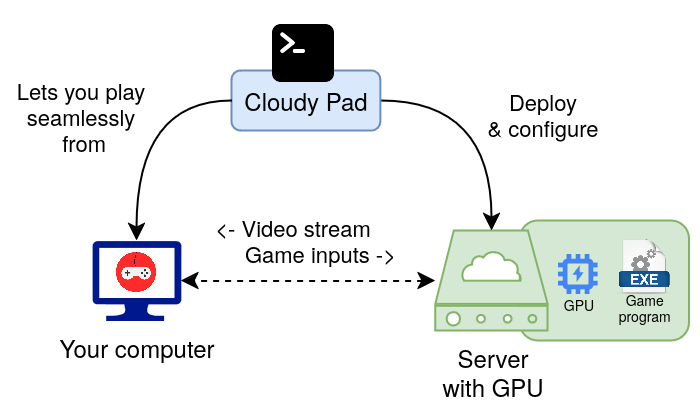

## What is Cloudy Pad ?

Cloudy Pad lets you deploy a Cloud gaming server anywhere in the world and play your own games - without requiring a powerful gaming machine or a costly subscription:

## Features ✨

- Run any application (**Steam**, Pegasus, Firefox...) thanks to [Wolf streaming server](https://games-on-whales.github.io/wolf/stable/)
- Deploy on **AWS**, **Google Cloud**, **Azure** or **Paperspace**
- Use **Spot instances** for up to **90% cheaper** instances with some Clouders
- Play **30 hours per month** for **~15$ / month or less**
- **Pay by the hour, no subscription** required
- Compatible with **[Moonlight](https://moonlight-stream.org/)** streaming client

**Not familiar with Cloud Gaming ?** See [What's Cloud Gaming and how is Cloudy Pad useful ?](./docs/what-is-cloudy-pad.md)

## Getting started

🚀 [Follow Getting started guide](./getting-started.md) to deploy your Cloudy Pad instance

💰 [Understand Cloud provider costs](./cost) - Cloudy Pad itself is free, but Cloud provider usage is not. Make sure you understand Cloud costs before deploying your instance 😉

## Development status 🧪

This project is still at an experimental phase. While working and allowing you to play in the Cloud seamlessly, there may be breaking changes in the future. **Your feedback, bug reports and contribution will be greatly appreciated !**

## Cloud Providers

Available Cloud providers:

- [Paperspace](https://www.paperspace.com/)
- [Google Cloud](https://cloud.google.com)
- [Azure](https://azure.microsoft.com)
- [AWS](https://aws.amazon.com/)

Potential future Cloud providers - upvote them on their GitHub issues!
- [Oblivus](https://oblivus.com/pricing/) - [👍 on GitHub issue](https://github.com/PierreBeucher/cloudypad/issues/4) if you want it implemented
- [TensorDock](https://www.tensordock.com/) - [👍 on GitHub issue](https://github.com/PierreBeucher/cloudypad/issues/5) if you want it implemented
- [Vulture](https://www.vultr.com/pricing/#cloud-gpu) - [👍 on GitHub issue](https://github.com/PierreBeucher/cloudypad/issues/3) if you want it implemented
