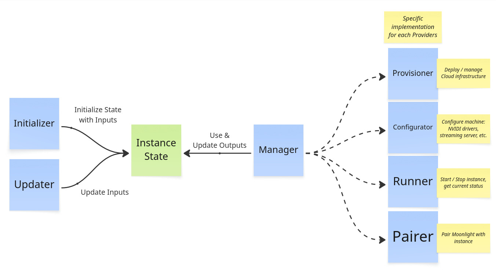

# Cloudy Pad architecture overview



Cloudy Pad code has 3 main parts:

- **Core** - Internal components to manage instances and deployment
- **Provider implementations** - implementation of instance deployment and management for various Providers
  - A Provider is a specialization of Core components to deploy instances in a given context
  - For example `aws` Provider is the implementation of instance deployment on AWS (Amazon Web Services)
- **CLI** - Wrapper around Core components to provide the Cloudy Pad CLI with interactive prompts

### Instance lifecycle and Core components


Instance lifecycle:

**Initialization (or creation)**

An [Instance State](#instance-state) is initialized with various Inputs (e.g. provider, region, instance type and specs, etc.). On initialization, the instance is:

- Provision - Cloud infrastructure is provisioned (creation of virtual machine, disk storage, etc. for instance) - most of the time with Pulumi (an Infrastructure as Code tool). Note a Cloud infrastructure is not always required, such as with SSH provider, in which case provisioning is no-op.
- Configuration - Installation of OS-level components: NVIDAI drivers, Sunshine / Wolf streaming server, etc. via Ansible (an Infrastructure as Code tool)
- Pairing - Instance is paired with Moonlight client 

These steps can also be run separately (e.g. `cloudypad provision`)

Related code:

- `core/initializer.ts` - `InstanceInitializer` - Manage overall initialization and deployment with `InstanceManager`
- `core/manager.ts` - `InstanceManager` - manages instance lifecycle with:
  - `core/provisioner.ts` - `InstanceProvisioner`
  - `core/configurator.ts` - `InstanceConfigurator`
  - `core/moonlight/pairer.ts` - `MoonlightPairer`

**Usage lifecycle: start and stop**

After initilialization, instance can be started and stopped.

Related code:

- `core/manager.ts` - `InstanceManager` - manages instance lifecycle with `Runner`.
- `core/runner.ts` - `InstanceRunner` - Manages instance start/stop actions

**Deletion**

Destroy instance. Instance deletion deletes infrastructure (instance, disk, etc.) and related [Instance State](#instance-state)

Related code:

- `core/manager.ts` - `InstanceManager` - manages instance lifecycle with `Runner`.
- `core/provisioner.ts` - `InstanceProvisioner`

### Instance State

The Instance State represents the state in which an instance is. It roughly contains:
- Instance name
- Provider name (AWS, Azure, etc.)
- Inputs: desired instance configurations (instance type, region, streaming server, etc.)
- Outputs: actual infrastructure state (disk storage unique ID, IP address, etc.)

Each Provider implements its own state interface based on a common State implementation. State is by default persisted as a local YAML file under `~/.cloudypad/instance/<name>/state.yml`

Example State file:

```yaml
name: aws-instance
version: '1'

# Provision inputs and outputs
provision:
  provider: aws # provider name

  # Desired instance state for AWS
  input:
    diskSize: 200
    instanceType: g4dn.2xlarge
    publicIpType: static
    region: eu-central-1
    ssh:
      user: ubuntu
      privateKeyContentBase64: xxx
  
  # Actual infrastructure state
  # for AWS, host is instance static IP address and instanceId the EC2 instance ID
  output:
    host: 18.199.182.227
    instanceId: i-0ae901f1799b17fdf

# Configuration inputs and outputs
# used to configure instance
configuration:
  configurator: ansible
  input:
    sunshine:
      enable: true
      passwordBase64: xxx
      username: sunshine
```

As state is written and read externally, [Zod](https://zod.dev/) is used to enforce TypeScript typing.

See `src/core/state`

### Provider implementation

A Provider is a specialization of Core components to deploy instances in a given context (usually a Cloud provider). For example `aws` Provider is the implementation of instance deployment on AWS (Amazon Web Services).

Each provider is based on the same pattern. Example for AWS provider in `src/providers/aws`:

- `pulumi.ts` - Pulumi is an Infrastructure as Code and provisioning tool (like Terraform) to manage Cloud resources. This file defines the Stack program used for each provider.
- `state.ts` - Extends `InstanceStateV1` with Inputs and Outputs specific to this provider
- `provisioner.ts` - Implements `InstanceProvisioner` for this provider. Use State Inputs to configure and run Pulumi stacks (or create infra with Provider API directly)
- `runner.ts` - Implements `InstanceRunner` for this provider. Use a Provider specific client to call Provider API to start/stop/... instance infrastructure. 
- `cli.ts` - CLI implementation for this provider. Define Provider specific CLI args and command implementation (e.g. `create` arguments which are specific per providers)
- `sdk-client.ts` - or in a `client/` folder. Provider specific SDK clients to interact with various resources (get server status, list available regions, etc.)

More internal-oriented files:

- `provider.ts` - Implements `ProviderClient` for this Provider.
- `factory.ts` - Implements `ProvisionerFactory` for this Provider. 