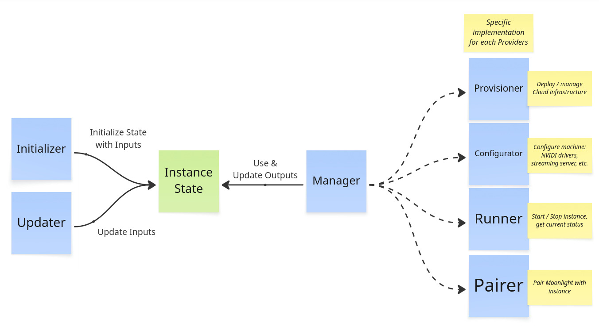
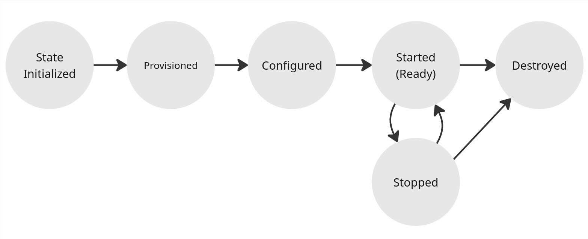

# Contribution Guide

Thanks for considering contributing to Cloudy Pad! This guide will help you get started contributing to various parts of the project.

Here's a typical workflow outline for contributions:

1. Understand [project architecture](#architecture-overview)
2. [Fork Cloudy Pad on GitHub or clone project locally](https://github.com/PierreBeucher/cloudypad) 
3. Setup your development environment
   - Development environment setup is **fully automated!** Don't worry about tooling installation and setup
4. Write code 
   - Use of AI is encouraged, we provide contextual AI `AGENTS.md` and Cursor rules files. 
   - You can also pass this contribution guide directly to AI context
   - Make sure to review and test your code before going forward though. Unsupervised IA contribution are unlikely to pass review.
5. Run tests and review
   - A simple `task test-unit` and human is enough for most situations
   - Detailed testing and debugging instructions are provided for more complex situation
6. Submit Pull Request

**Table of Content**

---
- [Getting started: setup development environment, build and run tests](#getting-started-setup-development-environment-build-and-run-tests)
- [Architecture Overview](#architecture-overview)
  - [Instance lifecycle and Core components](#instance-lifecycle-and-core-components)
  - [Instance State](#instance-state)
  - [Provider implementation](#provider-implementation)
- [Using AI is encouraged - with caveats](#using-ai-is-encouraged---with-caveats)
- [Where and how to contribute ?](#where-and-how-to-contribute-)
  - [Updating a provider (AWS, Azure, GCP, etc.)](#updating-a-provider-aws-azure-gcp-etc)
  - [`cloudypad` CLI: fixing bugs, adding arguments, etc.](#cloudypad-cli-fixing-bugs-adding-arguments-etc)
  - [Instance configuration: NVIDIA driver install, Sunshine / Wolf deployment, etc. via Ansible Playbook](#instance-configuration-nvidia-driver-install-sunshine--wolf-deployment-etc-via-ansible-playbook)
  - [Documentation, troubleshooting guide and other non-code related tasks](#documentation-troubleshooting-guide-and-other-non-code-related-tasks)
  - [Cloudy Pad desktop and Sunshine server container image (Docker)](#cloudy-pad-desktop-and-sunshine-server-container-image-docker)
- [Running / writing tests and verifying your changes locally](#running--writing-tests-and-verifying-your-changes-locally)
  - [Running tests](#running-tests)
  - [Adding and writing tests](#adding-and-writing-tests)
- [Debugging](#debugging)
  - [CLI log level](#cli-log-level)
  - [Ansible playbook](#ansible-playbook)
  - [Local Pulumi stack manipulation](#local-pulumi-stack-manipulation)
  - [Local Virtual Machine as Cloudy Pad instance](#local-virtual-machine-as-cloudy-pad-instance)
- [Create a Pull Request with your changes](#create-a-pull-request-with-your-changes)
  - [Review process](#review-process)
- [Useful commands](#useful-commands)
- [Get help on Discord !](#get-help-on-discord-)


## Getting started: setup development environment, build and run tests

A **fully automated development environment** is provided by Nix Flake (see `flake.nix` at project root). It will setup the required tools with desired versions in a kind of virtual development environment which will **not impact or change your own tool version anywhere else on your machine.**

You only need to install:

- [Nix](https://nixos.org/download/)
- [Docker](https://docs.docker.com/engine/install/)

Start a Nix development shell: it will download packages and setup your development environment. **The first run may take some time** - don't worry subsequent runs are almost instantaneous:

```sh
nix develop
```

You can then run commands:

```sh
# Build Node CLI package
task build-npm

# Run unit tests
task test-unit
```

Most commands are wrapped as a `task` - See `Taskfile.yml` at project root. 

You're ready to contribute !

## Architecture Overview



Cloudy Pad code has 3 main parts:

- **Core** - Internal components to manage instances and deployment
- **Provider implementations** - implementation of instance deployment and management for various Providers
  - A Provider is a specialization of Core components to deploy instances in a given context
  - For example `aws` Provider is the implementation of instance deployment on AWS (Amazon Web Services)
- **CLI** - Wrapper around Core components to provide the Cloudy Pad CLI with interactive prompts

### Instance lifecycle and Core components



Instance lifecycle:

**Initialization (or creation)**

An [Instance State](#instance-state) is initialized with various Inputs (e.g. provider, region, instance type and specs, etc.). On initialization, the instance is:

- Provision - Cloud infrastructure is provisioned (creation of virtual machine, disk storage, etc. for instance) - most of the time with Pulumi (an Infrastructure as Code tool). Note a Cloud infrastructure is not always required, such as with SSH provider, in which case provisioning is no-op.
- Configuration - Installation of OS-level components: NVIDAI drivers, Sunshine / Wolf streaming server, etc. via Ansible (an Infrastructure as Code tool)
- Pairing - Instance is paired with Moonlight client 

These steps can also be run separately (e.g. `cloudypad provision`)

Related code:

- `core/initializer.ts` - `InstanceInitializer` - Manage overall initialization and deployment with `InstanceManager`
- `core/manager.ts` - `InstanceManager` - manages instance lifecycle with:
  - `core/provisioner.ts` - `InstanceProvisioner`
  - `core/configurator.ts` - `InstanceConfigurator`
  - `core/moonlight/pairer.ts` - `MoonlightPairer`

**Usage lifecycle: start and stop**

After initilialization, instance can be started and stopped.

Related code:

- `core/manager.ts` - `InstanceManager` - manages instance lifecycle with `Runner`.
- `core/runner.ts` - `InstanceRunner` - Manages instance start/stop actions

**Deletion**

Destroy instance. Instance deletion deletes infrastructure (instance, disk, etc.) and related [Instance State](#instance-state)

Related code:

- `core/manager.ts` - `InstanceManager` - manages instance lifecycle with `Runner`.
- `core/provisioner.ts` - `InstanceProvisioner`

### Instance State

The Instance State represents the state in which an instance is. It roughly contains:
- Instance name
- Provider name (AWS, Azure, etc.)
- Inputs: desired instance configurations (instance type, region, streaming server, etc.)
- Outputs: actual infrastructure state (disk storage unique ID, IP address, etc.)

Each Provider implements its own state interface based on a common State implementation. State is by default persisted as a local YAML file under `~/.cloudypad/instance/<name>/state.yml`

Example State file:

```yaml
name: aws-instance
version: '1'

# Provision inputs and outputs
provision:
  provider: aws # provider name

  # Desired instance state for AWS
  input:
    diskSize: 200
    instanceType: g4dn.2xlarge
    publicIpType: static
    region: eu-central-1
    ssh:
      user: ubuntu
      privateKeyContentBase64: xxx
  
  # Actual infrastructure state
  # for AWS, host is instance static IP address and instanceId the EC2 instance ID
  output:
    host: 18.199.182.227
    instanceId: i-0ae901f1799b17fdf

# Configuration inputs and outputs
# used to configure instance
configuration:
  configurator: ansible
  input:
    sunshine:
      enable: true
      passwordBase64: xxx
      username: sunshine
```

As state is written and read externally, [Zod](https://zod.dev/) is used to enforce TypeScript typing.

See `src/core/state`

### Provider implementation

A Provider is a specialization of Core components to deploy instances in a given context (usually a Cloud provider). For example `aws` Provider is the implementation of instance deployment on AWS (Amazon Web Services).

Each provider is based on the same pattern. Example for AWS provider in `src/providers/aws`:

- `pulumi.ts` - Pulumi is an Infrastructure as Code and provisioning tool (like Terraform) to manage Cloud resources. This file defines the Stack program used for each provider.
- `state.ts` - Extends `InstanceStateV1` with Inputs and Outputs specific to this provider
- `provisioner.ts` - Implements `InstanceProvisioner` for this provider. Use State Inputs to configure and run Pulumi stacks (or create infra with Provider API directly)
- `runner.ts` - Implements `InstanceRunner` for this provider. Use a Provider specific client to call Provider API to start/stop/... instance infrastructure. 
- `cli.ts` - CLI implementation for this provider. Define Provider specific CLI args and command implementation (e.g. `create` arguments which are specific per providers)
- `sdk-client.ts` - or in a `client/` folder. Provider specific SDK clients to interact with various resources (get server status, list available regions, etc.)

More internal-oriented files:

- `provider.ts` - Implements `ProviderClient` for this Provider.
- `factory.ts` - Implements `ProvisionerFactory` for this Provider. 

## Using AI is encouraged - with caveats

You are encouraged to use AI to contribute to Cloudy Pad. `AGENTS.md`-like files are present under `.cursor/rules` - make sure to include them. They describe expected best practices and context for AI to better understand the project. 

Please note:

- Even though AI use is encouraged, please review your code and follow best practices
- Do not contribute a PR without reviewing and testing your changes. A PR with low-effort and/or broken AI-generated code will slow down the merging process

## Where and how to contribute ?

Depending on your contribution, here are various guides to get started: where is code located, guidelines to get started in code and various tips.

Make sure to read [Architecture overview](#architecture-overview) first 😉

### Updating a provider (AWS, Azure, GCP, etc.)

Providers are located under `src/providers/<provider>` with a similar structure. You might want to

- Update infrastructure used for provider in `pulumi.ts`
- Improve CLI arguments and prompting for a provider in `cli.ts`

See [Provider implementation](#provider-implementation) to get a better understanding of Providers.

### `cloudypad` CLI: fixing bugs, adding arguments, etc.

CLI entrypoint is `src/cli/main.ts`. CLI is constructed by:

- Building `Commands` objects based on common arguments (as often same arguments are present in multiple commands)
- `program.ts` describes various commands and available options
- `initializer.ts` and `updater.ts` are wrappers around their Core equivalents to prompt users for specific details during `cloudypad create` and `cloudypad update`

On running CLI:

- CLI args are parsed into a `CliArgs` interface
- `CliArgs` is transformed into a Core interface `InstanceInputs` describing inputs (~configurations) for an instance by `prompter.ts` `cliArgsIntoPartialInput()`

To add or update CLI arguments you can:

- Add/update arguments in main program
  - You may also need to update provider-specific `cli.ts`, e.g. `src/providers/aws/cli.ts` for AWS. These files define CLI arguments specific to each provider. 
- Update `prompter.ts` to pass new arguments into `InstanceInputs`
- If needed, update `prompter.ts:completeCliInput()` to prompt the user for input if missing from CLI args
- From this point on, `InstanceInputs` are passed through to internal components. You can now change code to use your changes. 

### Instance configuration: NVIDIA driver install, Sunshine / Wolf deployment, etc. via Ansible Playbook

Ansible (an Infrastructure as Code tool) is used to configure instances via playbooks in `ansible/`.

You can update playbook to:

- Change how NVIDIA drivers are installed
- Update Sunshine server setup
- Update Wolf server setup
- Customize per-provider behavior (e.g. package installation, add exceptions for some providers)
- Manage auto-stop mechanism (detect inactivity to automatically stop instance, avoiding unwanted Cloud cost)

### Documentation, troubleshooting guide and other non-code related tasks

Documentation at [https://docs.cloudypad.gg](https://docs.cloudypad.gg) is auto-generated from Markdown files under `docs/src`.

- Updating existing files: on merge, the documentation will be updated
- Adding new files: make sure to reference them in `docs/src/SUMMARY.md` to have them included

Run a local doc server to see the result of your updates via [http://localhost:3000](http://localhost:3000):

```sh
task mdbook-server
```

### Cloudy Pad desktop and Sunshine server container image (Docker)

The Sunshine streaming server or desktop container is what you see when you connect to Cloudy Pad via Moonlight (using Sunshine streaming server). Source code is located at `containers/sunshine`

Container is roughly built by:

- Installing a desktop environment on an Ubuntu base image
- Installing game launchers: Steam, Heroic, etc.
- Installing various tools and libraries (Proton, text editor, etc.)
- Adding an _overlay_ with various scripts and default config (Sunshine server config template, desktop environment config, etc.)

On startup, container starts Sunshine, the desktop and all required components. 

## Running / writing tests and verifying your changes locally

You'll want to test your changes and verify them along the way. Typical ways include:

### Running tests

Running unit tests:

```sh
task test-unit
```

Building application (plain node build or Docker build):

```sh
# Node build
task build-npm

# CLI Docker container build
task build-core-container-local
```

Running the CLI directly from your code - e.g. deploy an instance to verify your changes are applied correctly:

```sh
# Equivalent of `cloudypad --help` for development
npx tsx src/cli/main.ts --help

# Create a test instance
npx tsx src/cli/main.ts create aws my-test-instance [...]
```

See examples of fully automated instance deployment via CLI in `test/integ/unstable/cli-full-lifecycle`

### Adding and writing tests

Cloudy Pad has several layer of tests - most of them run on CI:

**Unit tests** 

Run unit tests via `task test-unit`. Unit tests are under `test/unit` and follow these global coding practices:

- Use [Mocha](https://mochajs.org/) for testing 
- `Test` structure matches `src` structure, e.g. `src/core/manager.ts` is tested via `test/unit/core/manager.spec.ts`
- Each test is self-contained. A test should not change or update data, variable or context which is also used by another test. If test needs setup (such as an existing instance State file), test setup should be done either in the `it()` function or in a before hook.
- Avoid using `before` in a spec file to set a global variable used by all tests. Prefer generating data in each test.
- Do not hesitate to look at similar tests to match their structure

About side effects:

- You must avoid side effects with unit tests (e.g. don't contact an external service or a database, etc.). Writing local files is accepted, but the method must guarantee proper reproducibility and debugging analysis (e.g. don't write a temporary test that can't be verified if something happens)
- If the component under tests relies on side effect, use [Sinon](https://sinonjs.org/) to stub calls causing side effect
- See `test/unit/hooks.ts` for globally defined stubs, e.g. for Pulumi or AWS clients

Unit tests have a few utility functions in `test/unit/utils.ts` to help:

- `createDummyState()` - Create dummy instance State for testing with optional overrides
- `initializeDummyInstanceState()` - Initialize a dummy instance state and return it
- `DEFAULT_COMMON_INPUT` - Instance inputs to use during test require Inputs or State
- `DEFAULT_COMMON_CLI_ARGS` - CLI argument matching DEFAULT_COMMON_INPUT
- `createTempTestDir(prefix)` - Create temporary directory for testing
- `getUnitTestCoreClient()` - Create a Core client suitable for testing with local data backend
- `getUnitTestCoreConfig()` - Create CoreConfig with local state backend for testing
- `getUnitTestDummyProviderClient()` - Create a dummy ProviderClient for testing

**Integration tests**

Stable integration tests are under `test/integ/stable` - they create real Cloud infrastructure to test instance lifecycles. They are not currently run on CI, only locally using your own credentials. 

**⚠️ Make sure to understand what these tests are doing before running them.**

Example:

```sh
# Run all integration tests
task test-integ-stable

# Run a specific provider integration tests
test-integ-provider-scaleway
```

**Other tests**

Various tests on CI also:

- Check documentation and dead links
- Verify build, compilation and linting
- Verify installation script

You can run them as `task` locally if CI reports issues.

## Debugging 

Various debugging methods:

### CLI log level

Set environment variable `export CLOUDYPAD_LOG_LEVEL=2` (DEBUG) or `3` (INFO) to show more information

### Ansible playbook

Ansible playbook is written locally under a temp directory at runtime. Ansible playbook path is shown at DEBUG log level. To debug configuration more easily:

- Run a deployment or configuration command, e.g. `CLOUDYPAD_LOG_LEVEL=2 npx tsx src/cli/main.ts configure my-instance`
- Logs will show something like
```
2025-10-09 14:14:18.448 DEBUG   src/tools/ansible.ts:15 AnsibleClient   Ansible command: ansible-playbook ["-i","/tmp/nix-shell.iuM9BJ/cloudypad-qBivGz/inventory.yml","/home/me/cloudypad/ansible/sunshine.yml","-e","'ansible_ssh_common_args=\"-o StrictHostKeyChecking=no\"'"]
```
- Use or edit Ansible playbook directly and run:
```sh
ansible-playbook -i /tmp/nix-shell.iuM9BJ/cloudypad-qBivGz/inventory.yml ansible/sunshine.yml
```

### Local Pulumi stack manipulation

Nix development shell automatically sets `PULUMI_BACKEND_URL` and `PULUMI_CONFIG_PASSPHRASE` environment variables, allowing you to manipulate Pulumi stacks locally.

```sh
# List stacks
pulumi stack ls -a

# Show stack resources
pulumi stack -s <organization/CloudyPad-XXX/STACK> --show-ids

# Destroy stack
pulumi destroy -s <organization/CloudyPad-XXX/STACK>
```

### Local Virtual Machine as Cloudy Pad instance

A local debug Virtual Machine (VM) can be set up with [Vagrant](https://developer.hashicorp.com/vagrant) and `Vagrantfile`. This machine matches a real-world Cloudy Pad instance except it does not use provisioning and may not have an available GPU (Cloudy Pad still works using CPU encoding).

Local VM goals:

- Test changes impacting configuration, typically:
- Changes to Ansible Playbook in `ansible/`
- Changes to Sunshine container image (Docker image) in `containers/`

**Local VM setup**

Debug VM can be setup with:

```sh
# Create VM
vagrant up

# Run configuration from Ansible playbook
task dev-ansible-config

# Might fail as :local tag doesn't exist
# Push local container image to VM
task dev-docker-sunshine-to-vm
```

**Using local VM**

Instance is reachable via `192.168.56.43`.

To pair, connect to the Sunshine web UI and use Moonlight manually:

```sh
# A TLS certificate warning is shown as certificate is self-signed
# login: sunshine
# password: @!/:,?!*#'€`_\µ$="foo
#   or 'sunshine'
https://192.168.56.43:47990/
```

**Debug container and Dockerfile changes**

During Sunshine container development, it's possible to use a Vagrant-specific Docker Compose which will mount folders from the host machine directly in the Cloudy Pad container.

For example, if you change `containers/sunshine/overlay/cloudy/conf/sunshine/sunshine.conf.template` locally, you don't need to rebuild the container image, you can mount this file directly in the VM container for faster testing:

- Update `test/resources/docker-compose.vagrant.yml` to mount desired files, for example:
```yaml
  volumes:
  # [...]
  #
  # Mount local containers/sunshine/overlay/cloudy/conf/sunshine/sunshine.conf.template
  # Local project is mounted at /vagrant, hence using /vagrant/<project/path>
  # 
  - "/vagrant/containers/sunshine/overlay/cloudy/conf/sunshine/sunshine.conf.template:/cloudy/conf/sunshine/sunshine.conf.template"
```
- Update container with custom mounts
```sh
vagrant ssh
$ docker compose -f /vagrant/test/resources/docker-compose.vagrant.yml -p sunshine up -d --force-recreate
```

## Create a Pull Request with your changes

When your changes are ready, you can [create a Pull Request](https://github.com/PierreBeucher/cloudypad/pulls). Please make sure to:

- Follow [conventional commits](https://www.conventionalcommits.org/en/v1.0.0/)
  - Eg. commit messages like `feat: added a nice feature`
  - See Git history as example
- [Verify your code](#running-tests): test, compilation, review, etc. 
- Explain your changes 

### Review process

Once your PR is created you should get an update within 3 days. If your PR is not acknowledged, please ping Pierre. 

While we'll do our best to merge your code ASAP, review process may take a bit of time and typically involves:

- Questions about your code
- Fixing a few things like design, refactoring, or adding tests

## Useful commands

`Taskfile` contains lots of commands available in development (see comments on tasks). Run with `task xxx`, e.g.:

```sh
task test-unit
```

## Get help on Discord !

[Get in touch on Discord](https://discord.gg/QATA3b9TTa) to get help for contributing - we'll happily guide you through !
