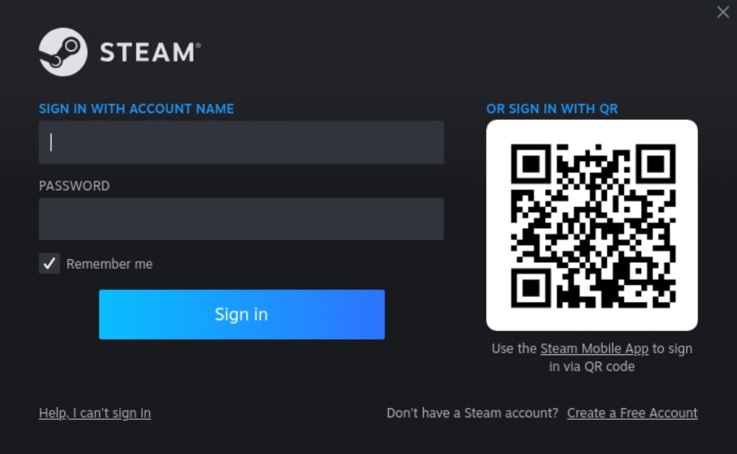

# Steam

- [Run Steam](#run-steam)
- [Sign in to Steam](#sign-in-to-steam)
  - [(Recommended) Mobile app with Steam Guard](#recommended-mobile-app-with-steam-guard)
  - [Password authentication](#password-authentication)
  - [I forgot my Steam username and/or password](#i-forgot-my-steam-username-andor-password)
- [Advanced configuration](#advanced-configuration)
  - [Steam data path](#steam-data-path)
  - [Configuring Mods](#configuring-mods)
  - [Change Proton version](#change-proton-version)

## Run Steam

Launch your instance and connect using Moonlight. Click _Steam_ icon in Moonlight to connect and start Steam. 

## Sign in to Steam

Steam is automatically installed by Cloudy Pad and starts automatically.

Steam welcome screen shows a login with a QR code and a login/password prompt. 

### (Recommended) Mobile app with Steam Guard

Use your phone or tablet to:
- Download Steam application and sign in to the app
- Tap on the shield 🛡️ button at the bottom of the screen
- Scan the QR code shown by Steam on Moonlight

### Password authentication

You can enter your Steam login and password directly

Note: it may be possible to copy/paste your password from host using `CTRL+ALT+SHIFT+V` on Linux/Windows or `Command+ALT+SHIFT+V` on MacOS, but [a known issue may prevent it from working](https://github.com/moonlight-stream/moonlight-qt/issues/1553)

### I forgot my Steam username and/or password

On your phone or tablet download Steam application and:
 
- Select _"I need help signing in"_ at bottom left
- Select _"I forgot my Steam account name or password"_
- Enter your email address or phone number and click on _"Continue"_
- Follow instructions to reset your password

## Advanced configuration

### Steam data path

From within Cloudy Pad, Steam data are located under:

- `/cloudy/data/Steam`
- `/cloudy/conf/steam`
- `$HOME/.steam`

If you're connected directly on host via SSH, see under `/var/lib/cloudypad/sunshine/`.

### Configuring Mods

Configuring Steam mods vary with games. If you need to install files locally, look under `/cloudy/data/Steam/steamapps/common/`

### Change Proton version

Proton provide compatibility with Windows games. Sometime using a different Proton version may help run a game or fix bugs. 

Go to _Steam > Settings > Compatibility > Default compatibility tools_ and chose a more recent (higher number) Proton version, or Proton Experimental for latest experimental version.