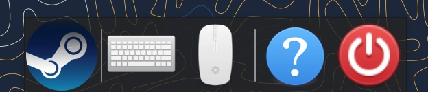
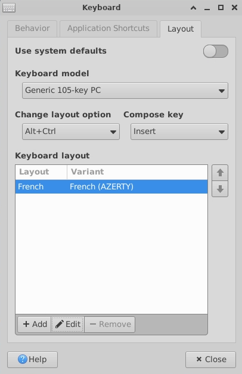

# Common configuration while Streaming

You can configure your keyboard and mouse after connecting with Moonlight using bottom toolbar Keyboard and Mouse icons.

## Keyboard configuration and layout

Click on keyboard icon at the bottom of screen:
- Go to _Layout_ tab
- Disable system default by unchecking _System default_ on top right

Then change your configuration:
- **Layout:** correspond to the first keys on your keyboard. Eg. if the first keys are A-Z-E-R-T-Y, use should `AZERTY` layout.
  - In _Keyboard layout_ box, Click on current layout and Edit. Select your layout.
- **Model:**
  - **Windows**: use Generic PC-104 or PC-105
  - **MacOS**: use Macbook or Macintosh
  - **Linux**: use Generic PC-104 or PC-105
  - If none of the above work, try to find your keyboard manufacturer in the list

## Mouse configuration

Set your mouse configuration (eg. pointer speed) after connecting with Moonlight: click on the Mouse icon at the bottom of the screen. Adapt configurations as per your needs.
