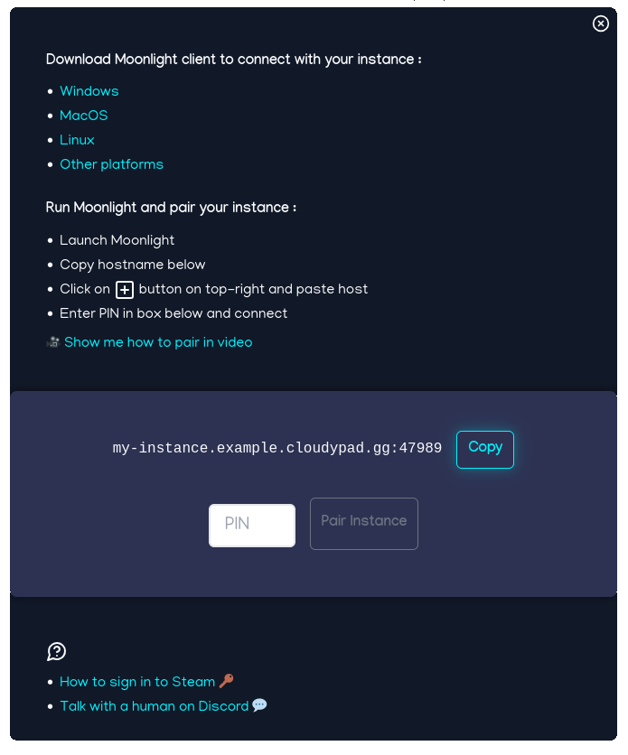

# Moonlight: install and connect

- [Download and install Moonlight](#download-and-install-moonlight)
- [Connect to your instance](#connect-to-your-instance)
  - [Cloudy Pad Platform](#cloudy-pad-platform)
  - [Cloudy Pad Community](#cloudy-pad-community)
- [Moonlight usage and configuration](#moonlight-usage-and-configuration)
## Download and install Moonlight

Moonlight is available for:
- [Windows](https://github.com/moonlight-stream/moonlight-qt/releases/download/v6.1.0/MoonlightSetup-6.1.0.exe)
- [MacOS](https://github.com/moonlight-stream/moonlight-qt/releases/download/v6.1.0/Moonlight-6.1.0.dmg)
- [Linux](https://github.com/moonlight-stream/moonlight-qt/releases)
- [Other platforms](https://github.com/moonlight-stream/moonlight-qt/releases)

See [Official Moonlight website](https://moonlight-stream.org/#) for more information.

## Connect to your instance

### Cloudy Pad Platform

[Cloudy Pad platform](https://app.cloudypad.gg/sign-in) lets you create instances via a web interface.

After creating your instance, to go _My Instances_, click on _Connect_ and follow instructions on screen



### Cloudy Pad Community

Pairing is done automatically when you run `cloudypad create`.

If needed, can pair your instance using Cloudy Pad CLI:

```sh
cloudypad pair my-instance

# Run this command in another terminal to pair your instance:
#
#   moonlight pair 35.181.136.176 --pin 1234
```

## Moonlight usage and configuration

See [Moonlight usage: screen size, latency, keyboard shortcuts, etc.](./moonlight-usage.md)
