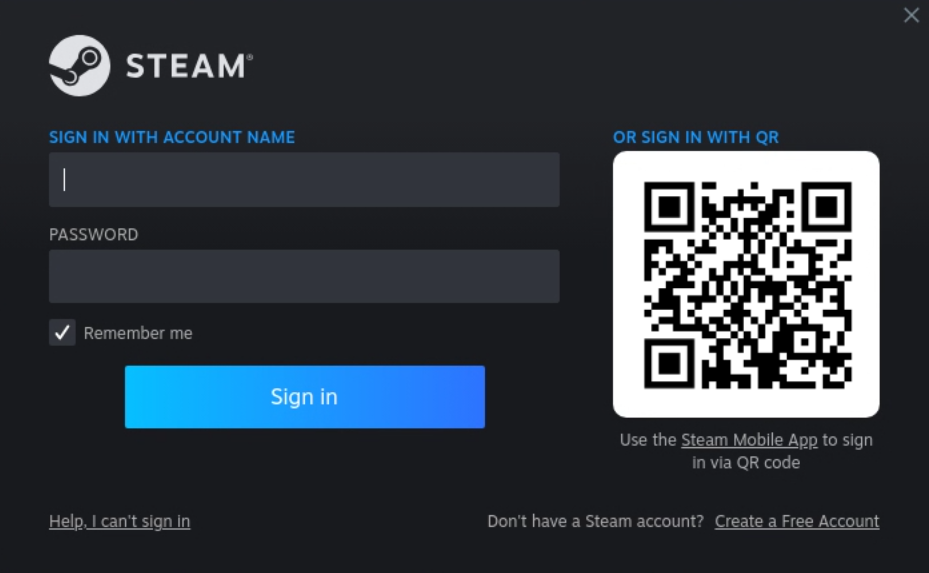
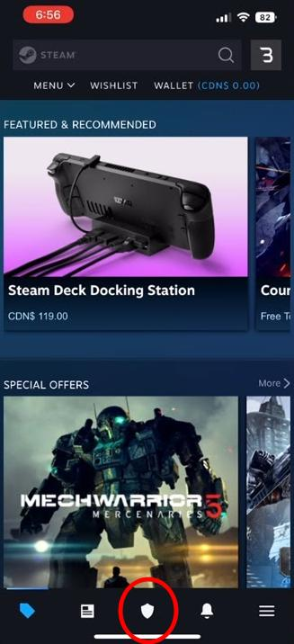

# Sign in to Steam

- [(Recommended) Mobile app with Steam Guard](#recommended-mobile-app-with-steam-guard)
- [Password authentication](#password-authentication)
- [I forgot my Steam username and/or password](#i-forgot-my-steam-username-andor-password)

Steam is automatically installed by Cloudy Pad and starts automatically.

Steam welcome screen shows a login with a QR code and a login/password prompt. 

## (Recommended) Mobile app with Steam Guard

Use your phone or tablet to:
- Download Steam application and sign in via the app
- Tap on the shield 🛡️ button at the bottom of the screen
- Scan the QR code shown by Steam on Moonlight

## Password authentication

You can enter your Steam login and password directly

Note: it may be possible to copy/paste your password from host using `CTRL+ALT+SHIFT+V` on Linux/Windows or `Command+ALT+SHIFT+V` on MacOS, but [a known issue may prevent it from working](https://github.com/moonlight-stream/moonlight-qt/issues/1553)

## I forgot my Steam username and/or password

On your phone or tablet download Steam application and:
 
- Select _"I need help signing in"_ at bottom left
- Select _"I forgot my Steam account name or password"_
- Enter your email address or phone number and click on _"Continue"_
- Follow instructions to reset your password