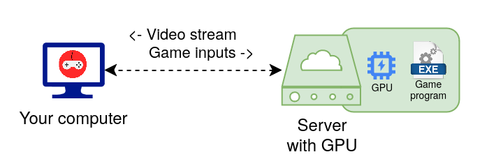

# What's Cloud Gaming ? How is Cloudy Pad useful ?

- [Cloud Gaming](#cloud-gaming)
- [Moonlight](#moonlight)
- [Cloud Provider](#cloud-provider)
- [CLI and console](#cli-and-console)
- [Docker](#docker)
- [How does it all fit in ?](#how-does-it-all-fit-in-)

This page is aimed at non-technical people or those unfamiliar with Cloud Gaming who wants a better understand of what Cloudy Pad can provide. We'll explain:

- What's _"Cloud gaming"_ ?
- What is _Moonlight_ and how is it related to _Cloud Gaming_ ?
- What is a _Cloud provider_ ?
- What is _Docker_ and why do we need it ?
- What is the `cloudypad` CLI ?

Cloud Gaming is the act of playing play video games directly from a server on the internet. This is called "Cloud Gaming". Our goal is to make Cloudy Pad usable by even non-tech savy users. While we're not there yet, we hope this page will help you have a better understanding.

## Cloud Gaming

Cloud gaming lets you play video games without needing a powerful console or computer at home. Think of it like streaming a movie on YouTube or Netflix: you open your browser and play a video. In this situation, the video comes from YouTube's _Servers_ into your computer. The Server does the heavy work of generating images for the video, while you only get the result as a video stream. 

To play video games you need lots of physical resources, more than what's required to generate a "simple" video stream like YouTube. That's why dedicated consoles or "gaming" computers are often required for recent games. This includes powerful GPUs (Graphical Processing Units) to generate the video stream for our video game. In a classic setup, your GPU is physically located within your machine.

With Cloud Gaming, **GPU power is delegated to a computer somewhere on the internet - in the _Cloud_ -  while you get the video game stream as a result.**

Hence, you don't need a powerful computer at home anymore, just something capable of handling a video stream and a good internet connection. It lets player enjoy games without requiring a high-end computer and occasional players can enjoy games without huge investment in costly materiel.

How do we get such as Server in the Cloud? See [Cloud Provider](#cloud-provider) below.

## Moonlight

[Moonlight](https://moonlight-stream.org/) is to Cloud Gaming what your browser (Firefox, Safari, Chrome...) is to YouTube: it allows you to connect to a server to play video game while your browser lets you connect to YouTube to watch videos. You install and run it like any other program !

Moonlight is called a _Client_ which will connect to our _Server_. 

## Cloud Provider 

A _Cloud Provider_ allow you to rent _Servers_ in the Cloud. Much like you'd rent a car for your holidays for a daily fee, _Cloud Providers_ let you rent _Servers_ for an hourly fee. With Cloud Gaming, we're gonna rent a server in order to play our games. 

You may already have heard of Cloud Providers such as AWS, Google Cloud, Microsoft Azure, etc. Cloudy Pad lets you (or will let you) play on these Cloud Providers and others, less known but cheaper, more adapted to our usage. 

## CLI and console

CLI (short for Command Line Interface) allow you to run _commands_ in a _terminal_ (a small window in which you can type text). That's a basic but very powerful way of running programs, and the primary way to run Cloudy Pad which does not (yet) have a graphical interface like your browser would.

Worry not, `cloudypad` CLI is easy to use and you'll be guided through usage.

## Docker

[Docker](https://www.docker.com/) is a tool required by Cloudy Pad to work. While it may seem strange to rely on yet-another technology do run Cloudy Pad, this allows Cloudy Pad to actually much more simpler to install and use, preventing you to install quite a lot of software and applications.

## How does it all fit in ?

Here's the thing: deploying a Cloud Server with everything you need to play video games is... a bit complex, to say the least. This documentation may seem a lot already, but it's only scratching the surface. 

That's where Cloudy Pad comes in ! Cloudy Pad lets you:

- Create a _Cloud Server_ suitable for video games and Cloud Gaming using the _Cloud Provider_ of your choice  🪄
- Configure your _Cloud Server_ and _Moonlight_ with all you need to stream video games ✨
- Manage your server lifecycle: create, start/stop, destroy... 🤖
- Avoid the complexity of installing and configuring lots of (even more) complicated software, Cloudy Pad does it for you with Docker ! 🚀

